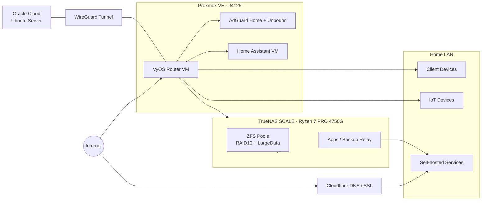

## 摘要
這是一套以 Proxmox VE + VyOS + TrueNAS SCALE + Oracle Cloud 組成的家用 HomeLab 架構，核心目標是安全、備份與自架服務。  
我把網路分層、儲存備援與服務維運分開處理，讓日常使用、異地備份與外網存取都能兼顧。  
實務上重視可維護性與風險控管，盡量以 CLI / 自動化腳本取代手動 GUI 操作。  

## 全域架構圖

## 用途
* 自架服務，如廣告 DNS Block、智慧家庭、多媒體音樂、相簿、程式碼 Repo、密碼庫及其他
* 備份中介站
* 暫時性外網檔案分享區，避免在外面電腦登入 Google Drive, Microsoft OneDrive 等敏感性帳號的風險
* 內網 Samba 分享服務
* 其他需長期執行，不適合桌面 PC 長時間開機，增加耗電的程序，如爬蟲、下載等
* 有些人 Self-hosted 還會玩追劇、追番、影片自動整理等等，但是我真的沒時間看那麼多多媒體，我覺得光 Netflix 就夠我看了 ~~儘管我覺得他的翻譯品質真的有夠~~
## 架構
* Proxmox VE
	* 硬體: 
		* 暢網 Intel J4125 四網口工控機
		* DNS Stack (Unbound + AdGuard Home)
	* Home Assistant in VM
	* VyOS in VM, as Router
* TrueNAS SCALE
    - 硬體: 
        - CPU: AMD Ryzen 7 PRO 4750G (8C/16T)
        - 主機板: ASUS ROG STRIX X570-E GAMING WIFI II
        - 記憶體: Kingston DDR4 32GB x 4（共 128GB，2800 MT/s）
        - 網路介面: Realtek RTL8125 2.5GbE、Intel I211 1GbE、Mellanox ConnectX EN 10GbE
        - 開機碟: TEAM T253512GB SATA SSD
        - ZFS Pool: 
            + PCIE 3.0 x 16 NVMe SSD Expansion Card with 4 slots (自帶拆分晶片)
              - NVMe SSD 500GB x 2
              - NVMe SSD 1TB x 2
            - 12TB HDD x3 + 8TB HDD x2
    - 主要 NAS, 備份, Self-hosted Apps Provider
- Oracle Cloud
## 特殊紀錄
* VyOS 替代掉原先的 OPNsense VM, 因為 PPPoE 效能略輸，且越來越覺得不需要這麼重的 GUI
	* 在家中建立了 VLAN 隔離了無線網路 IoT, 家中兩老一直抱怨更新介面找不到東西不想更新，然後又常常亂逛，我真的超怕惡意程式入侵
	* PPPoE 我為了在外存取方面，有申請固定 IP, 但是發現在特定時段，這條線路連常用服務如 Apple, Netflix...會比較慢, 所以後來在 VyOS 使用了雙 WAN, 並寫了 script ，使用 PBR 切換
	* DNS Stack 除了 Adguard Home 過濾廣告、惡意域名外，還另外寫了 Warm up script 來定時更新常被查詢的 DNS Record 加快查詢速度
	* 就算在內網，我也還是透過 Cloudflare API 以及 Caddy, Traefik 的簽發憑證方式，給 Self-hosted App 套上自己的域名
		* VyOS 有機會使用 VPP 向量來加速轉發，但是目前 VyOS CLI 還不支援 PPPoE 使用 VPP 的操作。待未來整合進去。
* 原先的 Synology NAS 被我拿去跟朋友交換回來一台二手機器，然後改採 TrueNAS 架構，原因是我真的比較用不到 Synology 內建的 UI 以及相關的應用程式
* TrueNAS 是備份中轉站，除了是大量檔案備份處，所有的重要檔案都會有一份在本地，另外一份透過內建的工具與 OneDrive 同步，落實異地備份原則
* Oracle Cloud 透過 WireGuard 與本地網路相連接，有部分 Self-hosted 放在 Oracle Cloud 但是不對外暴露，僅放在 WireGuard Interface 上，類似 Tailscale
> VyOS, TrueNAS, 以及 Oracle Cloud (Ubuntu Server), 這套架構的管理，我漸漸交給 LLM Coding Agent, 去做，剛好 VyOS 以及 TrueNAS 都有 CLI, 所以我可以指揮 Coding Agent 與他們互動並最佳化設定，可以不用透過 GUI 介面

## 關鍵字參考資料
* [VyOS Documentation](https://docs.vyos.io/en/latest/)
* [TrueNAS Documentation](https://www.truenas.com/docs/)
* [Proxmox VE Documentation](https://pve.proxmox.com/pve-docs/)
* [OpenZFS Documentation](https://openzfs.github.io/openzfs-docs/)
* [WireGuard Documentation](https://www.wireguard.com/)
* [AdGuard Home Wiki](https://github.com/AdguardTeam/AdGuardHome/wiki)
* [Unbound Documentation](https://nlnetlabs.nl/documentation/unbound/)
* [Home Assistant Documentation](https://www.home-assistant.io/docs/)
