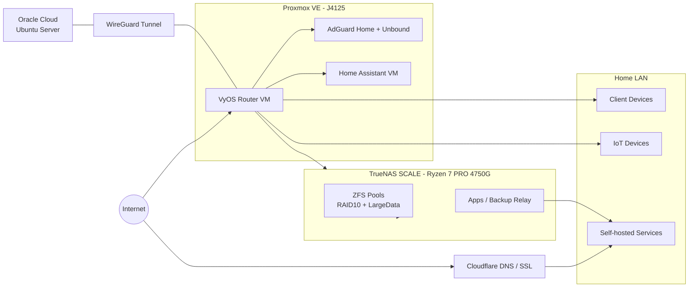

## Summary
This is a home HomeLab architecture composed of Proxmox VE + VyOS + TrueNAS SCALE + Oracle Cloud, with the core goals being security, backup, and self-hosted services.  
I handle network tiering, storage redundancy, and service operations separately, allowing daily use, off-site backup, and external network access are all covered.  
In practice, maintainability and risk management are prioritized, using CLI / automation scripts to replace manual GUI operations as much as possible.

## Global Architecture Diagram

## Use Cases
* Self-hosted services, such as ad-blocking DNS, smart home, multimedia music, photo albums, code repos, password vaults, and others
* Backup relay station
* Temporary external network file sharing area, avoiding the risk of logging into sensitive accounts like Google Drive or Microsoft OneDrive on outside computers
* Intranet Samba sharing service
* Other processes that need to run long-term and are unsuitable for keeping a desktop PC on for long periods, increasing power consumption, such as web scraping, downloading, etc.
* Some people doing self-hosting will also play around with binge-watching dramas and keeping up with anime, automatic video organization, etc., but I really don't have the time to watch that much multimedia; I feel like Netflix alone is enough for me ~~even though I think its translation quality is quite something~~
## Architecture
* Proxmox VE
	* Hardware: 
		* Changwang Intel J4125 4-port industrial PC
		* DNS Stack (Unbound + AdGuard Home)
	* Home Assistant in VM
	* VyOS in VM, as Router
* TrueNAS SCALE
    - Hardware: 
        - CPU: AMD Ryzen 7 PRO 4750G (8C/16T)
        - Motherboard: ASUS ROG STRIX X570-E GAMING WIFI II
        - Memory: Kingston DDR4 32GB x 4 (128GB total, 2800 MT/s)
        - Network Interfaces: Realtek RTL8125 2.5GbE, Intel I211 1GbE, Mellanox ConnectX EN 10GbE
        - Boot Drive: TEAM T253512GB SATA SSD
        - ZFS Pool: 
            + PCIe 3.0 x 16 NVMe SSD Expansion Card with 4 slots (with built-in bifurcation chip)
              - NVMe SSD 500GB x 2
              - NVMe SSD 1TB x 2
            - 12TB HDD x3 + 8TB HDD x2
    - Main NAS, Backup, Self-hosted Apps Provider
- Oracle Cloud
## Special Notes
* VyOS replaced the original OPNsense VM because its PPPoE performance was slightly inferior, and I increasingly felt that I didn't need such a heavy GUI.
	* I set up VLANs at home to isolate the wireless network IoT. My two elderly parents always complained that they couldn't find things in the update interface and didn't want to update, and they also often browse randomly; I am really afraid of malware intrusion.
	* For PPPoE, to facilitate external access, I applied for a static IP, but I found that during certain periods, this line would be slower connecting to common services like Apple, Netflix... Therefore, I later used dual WAN in VyOS and wrote a script to use PBR for switching.
	* For the DNS Stack, in addition to AdGuard Home filtering ads and malicious domains, I also wrote a warm-up script to regularly update frequently queried DNS Records to speed up query times.
	* Even on the intranet, I still put my own domains on Self-hosted Apps through the Cloudflare API and the certificate issuance methods of Caddy and Traefik.
		* VyOS has the opportunity to use VPP vectors to accelerate forwarding, but currently, the VyOS CLI does not yet support operations for PPPoE using VPP. Waiting for it to be integrated in the future.
* I traded my original Synology NAS with a friend for a second-hand machine and then switched to a TrueNAS architecture, because I really rarely used Synology's built-in UI and related applications.
* TrueNAS is a backup relay station. Aside from being a place for massive file backups, every important file will have one copy stored locally, while another copy is synchronized with OneDrive through built-in tools, implementing the off-site backup principle.
* Oracle Cloud is connected to the local network via WireGuard. Some Self-hosted services are placed on Oracle Cloud but are not exposed externally; they are only placed on the WireGuard Interface, similar to Tailscale.
> The management of this architecture—VyOS, TrueNAS, and Oracle Cloud (Ubuntu Server)—I am gradually handing over to an LLM Coding Agent. It just so happens that both VyOS and TrueNAS have CLIs, so I can instruct the Coding Agent to interact with them and optimize settings without needing to go through a GUI interface.

## Keyword Reference Materials
* [VyOS Documentation](https://docs.vyos.io/en/latest/)
* [TrueNAS Documentation](https://www.truenas.com/docs/)
* [Proxmox VE Documentation](https://pve.proxmox.com/pve-docs/)
* [OpenZFS Documentation](https://openzfs.github.io/openzfs-docs/)
* [WireGuard Documentation](https://www.wireguard.com/)
* [AdGuard Home Wiki](https://github.com/AdguardTeam/AdGuardHome/wiki)
* [Unbound Documentation](https://nlnetlabs.nl/documentation/unbound/)
* [Home Assistant Documentation](https://www.home-assistant.io/docs/)
