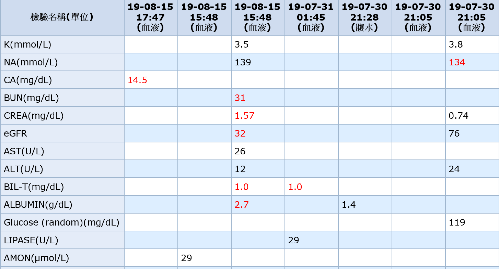
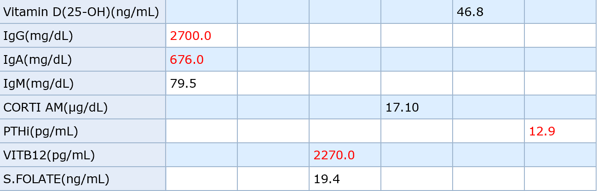
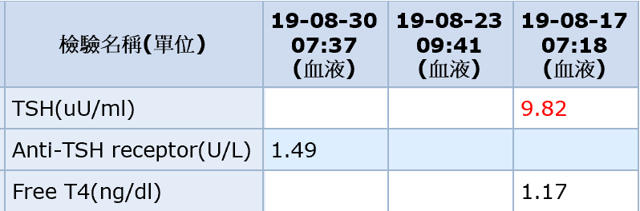
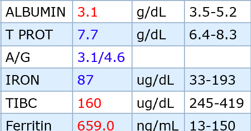
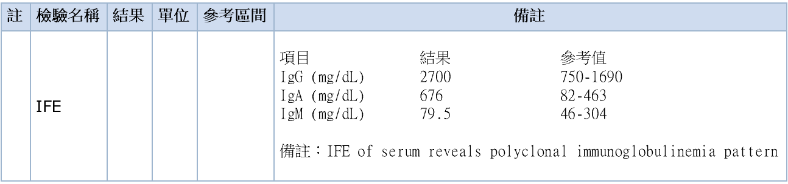
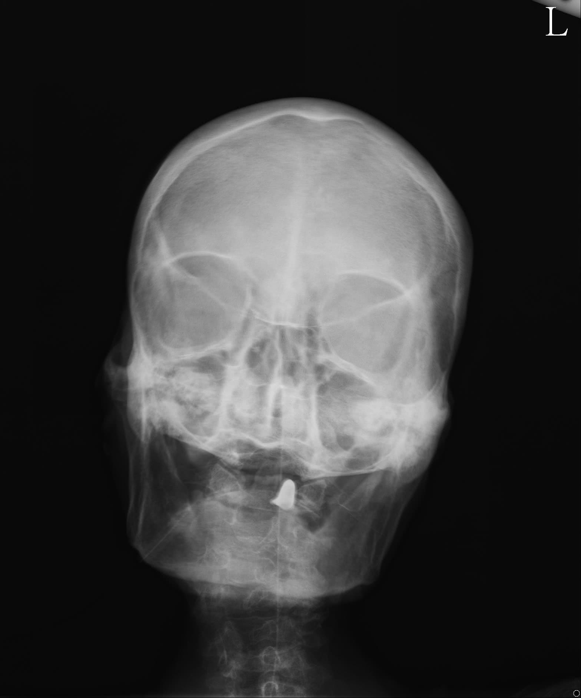
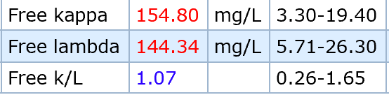
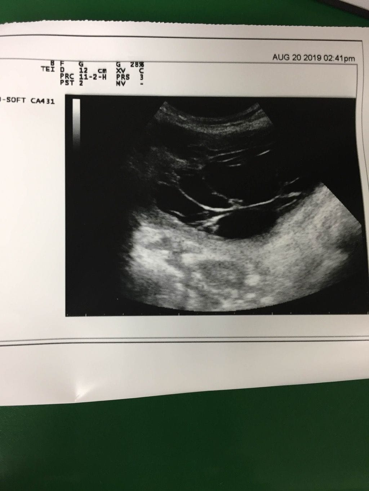
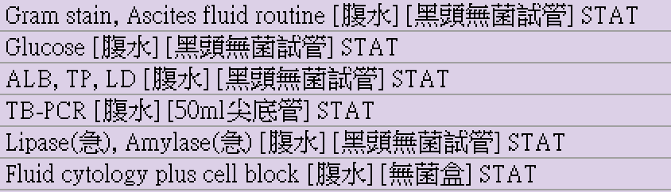
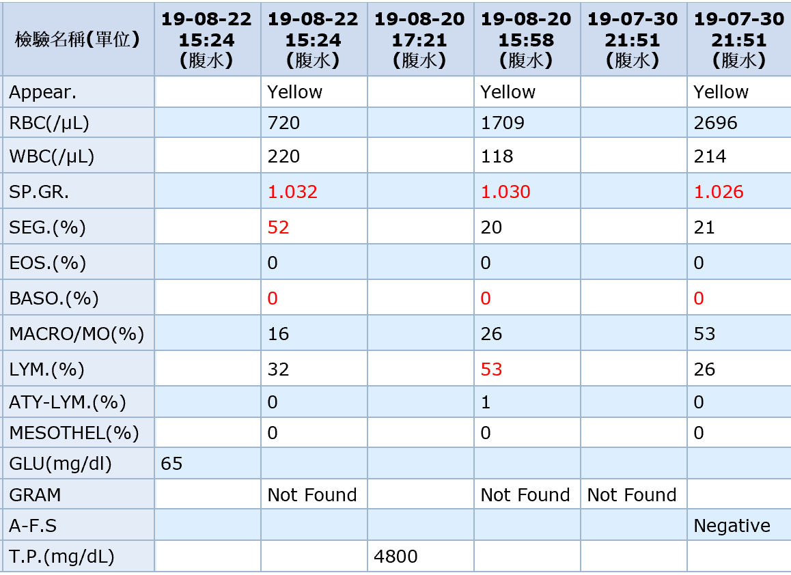

這是2019 年 九月 在 GI 病房碰到的一個意識改變的 Case，以下詳述。

80 y/r 女性，在今年初發現肝硬化合併腹水，被轉介來本院肝膽腸胃科門診，有抽血驗過 HBV, HCV, 皆陰性 。 病人在 8/11 的那個禮拜意識逐漸惡化，同時合併噁心嘔吐，胃口不佳，便秘等情形。經過 8/14 門診後，8/15 收住院抽腹水同時送檢驗。

Bedside 看到病人，評估 GCS 為E2V2M4 外，見到病人全身非常瘦弱，幾乎沒什麼肌肉，同時有腹脹，叩診呈濁音，從家人轉述及追蹤病歷記載，發現體重從三月到現在掉了 15 Kg。

肝膽腸胃科，意識改變最常見的原因是肝性腦病變(Hepatic encephalopathy)﹐但是當然必須排除其他原因，口訣 A - E - I - O - U - T - I - P - S ，考慮病史， 除了基本生化，CBC/DC，驗個血糖、電解質、Ammonia、Vein Gas，同時雖然沒有發燒，但為了排除感染在 VS 主治醫師的建議下抽了兩套 Blood culture。同時也提點了電解質方面主要會影響意識的是 Na, Ca

(有一位比較資深的 VS 說，他覺得 routine 抽 Ammonia 沒有什麼意義，因為其血液濃度跟肝性腦病變沒有完全相關，就算你抽到在正常範圍內也不能排除肝性腦病變。)

因為這個病人是在下午四點多時來的，成大醫院檢驗值警報簡訊通知時我還在醫院內，為了怕值班醫師 loading 太重，就自己處理，然後就接著處理到晚上八點多了，所以到現在印象還很深刻。

**血鈣高到 14.5 mg**

**血鈣高到 14.5 mg**

**血鈣高到 14.5 mg**

好吧，搜尋了一下，緊急症狀處理主要是積極的給水 Dilution 和給予降鈣藥物，詢問過當下選擇 Calcitonin 皮下注射。心電圖也得做一張。因為是 PGY 第一個月，每個事情都膽戰心驚，卡的點主要是啊都已經有腹水出來了，在給他豈不更多水跑進去腹腔？但是最後衡量高血鈣的危險性後腹水只能算是小事了。Lab data 有意義的還有 Anemia, Thrombocytopenia, Acute Kidney Injury, Hypoalbumenia

[台灣內科醫學會 -高血鈣的診斷與治療](http://www.tsim.org.tw/journal/jour28-3/07.PDF)

後來在住院期間，經過緊急處理 Hydration 加 Calcitonin 注射，病人血鈣降低，意識就逐漸清醒了，原先的噁心嘔吐便祕症狀也隨之改善，但是病因沒解決，高血鈣仍然會持續復發，在漫長的高血鈣 Survey 過程，每個禮拜血鈣都會高上來就得繼續Hydration 下去，中間還曾經一度有肺水腫跟低血鉀跑出來，病人家屬主護都表示心累，要跟主護家屬病解時都很心虛......

Survey 過程很曲折，綜合各方指引文，先有以下結果：1.PTHi 低 2. Vitamin D 25(OH)D是normal range，然後醫院是沒有1,25(OH)2D的，也沒有 PTHrP，驗甲狀腺功能後發現是 Subclinical Hypothyrodism，

回溯病人病史，家屬明確表示病人是直到意識改變後才開始躺床，不然平常是可以靠助行器行走且可以自己做家事的。家屬同時提到沒有高血鈣的家族病史，也沒有吃鈣片。另外有因為背痛骨頭痛 HIVD 去看疼痛科門診。

綜合起來啟動調查的主要有三大方向：

1. **Multiple myeloma** 多發性骨髓瘤或其他骨髓疾病
2. **Tuberculosis** 結核菌感染
3. **Cancer**

### Multiple Myeolma

會懷疑 Multiple myeloma 是因為病人其實有符合 CRAB 的症狀，

1. **C - Hypercalcemia**
2. **R - Renal complications**
3. **A - Anemia**
4. **B - Bone disease**

A/G ratio reverse 在這個病人有觀察到，但是肝硬化及Multiple myeloma 的病人皆可能出現，前者是因為 Albumin 變低，後者是因為球蛋白異常增多。以這病人來說，較難判斷。

驗了 IFE (免疫固定電泳分析)，發現 IgA, IgG 皆有增加情況，為 polyclonal pattern, 較不像 Multiple myeloma 的 monoclonal pattern ，而檢驗了頭骨 X-ray 也並沒有發現 Multiple myeloma 的蝕骨病灶。驗了 kappa/lamda ratio, 也是正常。

### Ascites 腹水

病人的 Chest X-ray 並沒有看到肺結核的特徵，留了兩套痰做 Acid-fast stain 也是陰性，第三套因為病人沒有痰在換月時遲遲沒有留出。讓人起疑的是腹水的超音波。

超音波下可以看到具有 loculated ascites 的特徵，請教學長後必須懷疑感染 peritonitis 或 Peritoneal carcinomatosis ，如果已經多次做過 Adominal tapping 放過多次腹水也有可能呈現這樣，但是病人是第一次放腹水。

嗯，於是腹水便送驗了一堆東西。

至少腹水的 Data 看起來不像有 SBP 感染，但是奇怪的點是 Total protein 很高，如果計算 SAAG 的話一定小於 1.1，可能疾病有TB peritonitis、peritoneal carcinomatosis、pancreatic ascites、nephrotic syndrome。其中 TB peritonitis 跟 peritoneal carcinomatosis 正是我們懷疑高血鈣的可能原因，從 Data 排除掉其他後，就再度送腹水驗 TB - PCR 跟 Cell cytology(看有沒有 malignancy)，結果都陰性......

### Cancer 的可能性？

短時間內體重掉很多，再加上高血鈣，Cancer的可能性的確很高。但是病人有一個尷尬的點是，七月底才因發燒腹痛來急診，有切過腹部電腦斷層，如果要在八月底再度做，可能會有健保核刪、輻射暴露等問題。那時腹部電腦斷層是沒有看到懷疑 Cancer 的病灶。前面的腹水送驗病理學報告也是陰性。頭頸部及乳房 Physical Examination 也並沒有看到明顯的腫塊病灶。唯一沒有做的就是胸部電腦斷層了......

### 換月前的最新進度

後來主治醫師跟家屬協調後，決定直接做全身電腦斷層掃描跟骨頭掃描，可能也有家屬請求不要這麼多折騰的因素在，但是瞄了一眼報告似乎胸部也沒有明顯病灶，主要還是腹部腹水那邊。之後有空，會再繼續追蹤。
