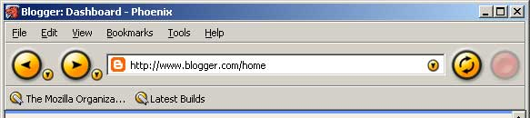

前幾天，Firefox推出版本號43, 一併推出Windows x64版本。Facebook貼文, Twitter以及其他科技媒體紛紛發布消息。雖然現在只有在網頁測試時才會開啟Firefox, 平常都使用Mac OS X平台專屬的Safari, 但是這個消息仍然勾起了一些對Firefox的回憶。

我使用Firefox的資歷應該可以說很早，Firefox一開始還不被叫做Firefox，被稱作Firebird（更早期版本甚至為Phoenix），版本號只有0.X。那個時期，微軟的Internet Explorer仍然獨霸網頁瀏覽器市場，台灣的電腦上基本上桌面只有一個藍色IE icon，國小的電腦教室，自然也不例外。不過莫名其妙的，我還是接觸到了IE以外的瀏覽器了XDDDD

教育部有一群人，很早以前就開始嘗試推廣"自由軟體“。我想當初推廣的目的之一有嘗試讓電腦教育脫離微軟Office，改採Openoffice等免費Office來節省微軟昂貴授權成本的考量。這個活動莫名地推廣到國小，於是我也接觸到了自由軟體的理念。老實說，小時候大都覺得免費的自由軟體介面鳥鳥的，沒有什麼吸引力，只有Firebird讓我一直摸。跟IE比起來，他能夠換佈景的特點深深吸引我的目光，一個閒閒沒事做的國小生，沒事就在那邊更換佈景打扮自己的Firebird XD。

後來逐漸上網去搜尋相關資料，那時的MozTW網站有完整的敘述，大意即是描述微軟與網景公司的愛恨情仇，過去Netscape的發展史以及Mozilla Suite 為什麼被開發。看到這篇我還特別去載了Netscape, Mozilla 玩玩看。以國小生的角度來說，安裝擴充套件、佈景主題，自訂介面，自行調整功能，就足夠讓人玩上一整天了。Netscape那時候還有一個Toy Factory的佈景， Factory很經典，Firefox也有一個早期的佈景主題Orbit Yellow也很漂亮。

現在回顧，或許我現在對於網路的知識，大部分都是從那時候奠基的吧？網頁與瀏覽器的關係，RSS書籤的應用，電子郵件收信(IMAP 與 POP3)，因為Netscape以及Mozilla Suite完整套裝都會提供整套的即時通訊(ICQ)、電子郵件收信Client等 。

國小升國中後，有一度我曾經放棄使用Firefox, 因為除了一些基本的佈景以外，那時的Firefox功能還很不完整，而且速度還沒有明顯超越IE，排版又很容易碰到不相容的網頁。直到國中後期我才開始繼續用。那時的Firefox聲勢漸漸崛起。一方面IE安全性事件頻傳，一方面Firefox推廣的人愈來愈多，唸高中時資訊社聯誼還特地邀請Mozilla社群的人來演講。

擴充套件的完善也是一個點，那時我很喜歡用的經典擴充套件有滑鼠手勢FireGestures、Tab Mix Plus, 還有All-in-one sidebars。那時候還會特別去鑽研一些特殊技巧如修改about:config設定值、玩Ramdisk。由於Firefox強勢崛起，較有底氣跟朋友推薦，其中一個理由就是眾多強大的擴充套件。那時還有一件很好笑的事，就是班上流行玩一款宇宙星球間攻略的網頁遊戲，結果被我推薦的一個好友，過幾天跟我說，他找到一款Firefox的擴充套件可以調整網頁遊戲的介面ＸＤＤＤＤ。(對了打到這裡又有一件回憶，某一次瞄到地獄少女動畫，電腦教室裡的瀏覽器是用Firefox作畫的)

不過上大學以後，Chrome就開始興起了。有了Firefox的經驗，Chrome的擴充套件完善速度更快，加上背後有Google強力撐腰，在Google首頁大力宣傳，在一般非資訊科技相關人士間傳播得更快，Firefox就相形失色了。另外Google投注的開發資源也較豐富，所以很快得Firefox的效能就被追過了。不過後來Firefox仍秉持著核心理念力求發展，將業務拓展到行動裝置以及對外謀求合作，我後來看到的最新消息是與三星合作未來會推出以Rust撰寫的Servo排版引擎。

不得不說，現今網路的蓬勃，有一部分就是因為Firefox在那個時期跳出來挑戰Internet Explorer，攪亂了一池春水。雖然現在網路瀏覽器以Chrome為主宰，但是Google的政策讓Chrome愈來愈肥大（程式碼與Chrome OS 共用, 背景執行太多資料同步），微軟在新的作業系統Windows 10 裡也推出了Edge試圖汰換掉原先的IE, 不過功能仍太過於陽春，Firefox儘管已經退出眾人的焦點之外，但是作為網路革新的前輩，他的一舉一動仍然有影響力。
