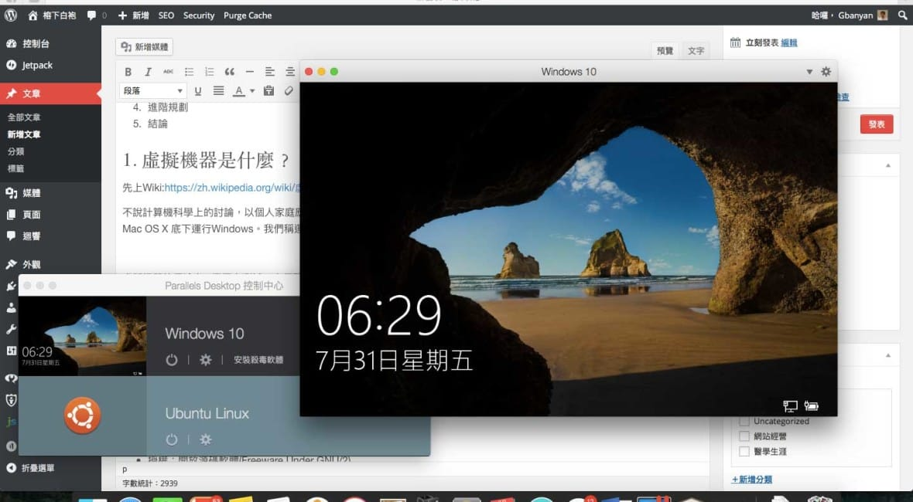

# 前言

身邊的同學買了Mac，第一個抱怨的往往是與Windows環境的相容性問題，比如學校的網站一定要在IE開，有些Office 格式在Mac 會跑掉。本文介紹在Mac OS X裡與Windows完美相容的解決方案 - 使用虛擬機器。

## 目錄

1. 虛擬機器是什麼？
2. 虛擬機器軟體
   1. Virtualbox
   2. VMware Fusion
   3. Parallel Desktop
3. 虛擬機器基本操作
4. 進階規劃
5. 結論

## 1. 虛擬機器是什麼？

先上Wiki:[https://zh.wikipedia.org/wiki/虛擬機器](https://zh.wikipedia.org/wiki/%E8%99%9B%E6%93%AC%E6%A9%9F%E5%99%A8)

不說計算機科學上的討論，以個人家庭應用市場來看，虛擬機器軟體可以在當前作業系統執行下，執行另外一套作業系統，比如在 Mac OS X 底下運行 Windows。我們稱運行虛擬機器軟體的作業系統本身為主體(host), 在虛擬機器中運行的作業系統為客體(guest)

虛擬機器的用途在IT業界有測試、方便開發軟體、伺服器運用分配等。但是在家用市場最主要是拿來解決軟體相容性的問題，比如想執行 Windows 底下的 Office，或是運行一些需要在 Internet Explorer 運行的網路銀行軟體。

由於在電腦運行的過程中，硬體效能資源都是由主體作業系統分配的，故虛擬機器需要與主體作業系統要求資源再行分配予客體作業系統，故客體作業系統運行起來，效能較不佳，以 Mac OS X 用戶群中常被詢問的關於遊戲的需求，這點是需要考慮的。

## 2. 虛擬機器軟體

在 Mac OS X 家用市場上的虛擬機器軟體主要有三套：Virtualbox, VMWare Fusion, Parallel Desktop。以下分別來介紹：

### Virtualbox

* 授權：開放源碼軟體(Freeware Under GNU/2)
* 費用：免費
* 官網連結：<https://www.virtualbox.org>
* 維基百科條目：<https://en.wikipedia.org/wiki/VirtualBox>
* 效能 ＊＊＊
* 功能 ＊＊＊
* 是否支援Bootcamp：否

Virtualbox是昇陽公司推出的虛擬機器軟體，在三套軟體中的特色是不需任何費用即可使用，且具有中文介面，但是在功能支援性以及效能來說是三者中最低的。

另外也不支援從現有Mac Bootcamp分割中直接讀取Windows資料並運行。

### VMWare Fusion

* 授權：商業軟體
* 費用：要錢
* 官網連結：<http://www.vmware.com/tw/products/fusion>
* 效能 ＊＊＊＊
* 功能 ＊＊＊＊
* 是否支援Bootcamp：是

VMWare Fusion是 VMWare 這間公司推出的虛擬機器軟體，VMWare在虛擬機器業界有領導者地位，對不同平台的相容性最佳，如果想要在Mac 下面運行並測試Linux，我會推薦Vmware Fusion。

缺點是沒有中文介面，進階設定對中文使用者來說會較不友善，也許未來會改善。

### Parallel Desktop

* 授權：商業軟體
* 費用：要錢
* 官網連結：<http://www.parallels.com/tw/products/desktop/>
* 效能 ＊＊＊＊＊
* 功能 ＊＊＊＊＊
* 是否支援Bootcamp：是

Parallel Desktop 是Mac 用戶裡虛擬機器市佔率最高的軟體，但是也最貴。以目前該公司的策略，配合Mac OS X 更新，每年暑假會推出新版，並會持續維護前一版繼續支援兩年至兩代Mac OS X最新版本。若持續追最新版本，雖有升級優惠價，仍是一筆不小的費用。

其介面是三者之間最友善，有中文，且對在Mac 底下對Windows的支援，包括功能性、效能，是三者之中最好的，但是對其他平台則不如VMWare Fusion，以Linux來說我覺得是半殘。

2015.8.20 更新：Parallel Desktop 11推出，並開始分成買斷制標準版以及訂閱制專業版。詳細比較可以看[這邊](http://www.parallels.com/upgradepd11/?x-source=email_pd10&x-campaign=pd11launch&utm_source=pd10&utm_medium=email&utm_campaign=pd11launch)

## 3. 虛擬機器的基本操作

### 建立虛擬機器

虛擬機器軟體在建立客體作業系統環境時，會先建立模擬硬碟檔以及相關設定檔，並統一儲放在單一資料夾內，所有在客體作業系統內的變更都會寫入至該模擬硬碟檔。也就是移動或複製該資料夾的話，就等於是移動或複製整份虛擬機器。

以Parallel Desktop的虛擬機器文件檔為例

也有的軟體支援直接讀取Bootcamp磁區。

另外，虛擬機器皆支援外掛映像檔，也就是從主體作業系統讀取映像檔掛載至客體作業系統，當作外接光碟機至客體。若要安裝作業系統，可以下載原始作業系統映像檔，然後直接從該映像檔讀取安裝。

### 虛擬機器開關

* 暫停:僅是停止CPU運作，所有記憶體佔用都仍在，因此仍會耗電，暫停以及恢復僅需瞬間。
* 中止:將虛擬機器目前的所有狀態包含執行的程式、編輯的文件，儲存到硬碟裡，中止程序需要等待寫入硬碟的時間。
* 關閉:意義等同於在虛擬機器內按下關機
* 重新啟動:意義等同於在虛擬機器內按下重新開機
* 停止

Parallel Desktop 開關機操作

### 

VMware Fusion 開關機操作

VirtualBox 基本操作

### 虛擬機器操作輔助

硬體支援如USB裝置、印表機、Webcam等，虛擬機器軟體一定都可以轉送控制權到客體作業系統，但是功能完整於否取決於虛擬機器軟體提供的工具包。

這類工具包除了包客體作業系統的驅動程式，可增進顯示以及運算效能外，也提供了一些方便的溝通橋樑，如：

* 拖放：可隨意從主體作業系統拉動檔案至客體作業系統，反之亦然
* 剪貼簿共用：複製貼上無縫接軌，即在主體作業系統複製或剪下一段資料或檔案，可以在客體直 接貼上，反之亦然
* 共享資料夾：以網路共享資料夾或掛載網路磁碟機形式，將主體作業系統的資料開放給客體作業 系統讀取。

在Parallel Desktop的選項內可以設定共用資料夾

## 4.進階規劃

### 硬體資源

虛擬機器因為好比就像操作一台完整的機器，只是要給予多少硬體資源由模擬的軟體介面來定義。而要給予多少硬體資源，應考量的因素就好比組裝一台機器一樣，用途(文書上網、遊戲、模擬運算)、速度優先還是行動優先都有相對應的調整選項

一般來說，虛擬機器在調控硬體資源的設定視窗，都有給予建議值範圍參考，另外如果新創虛擬機器，偵測即將要安裝的作業系統，虛擬機器軟體也會自動給予最低要求的硬體資源，如Windows 7 最低配置1 GB 記憶體。

Parallel Desktop這套軟體則直接給予生產力、遊戲、設計、軟體發展等不同的設定建議。

### 快照

虛擬機器軟體有提供一個特殊的功能：快照(Snapshot)

快照其實跟Windows的還原點邏輯有點像，在當下虛擬機器的狀態建立快照，就好像將時空定格一般，把當下虛擬機器的狀態一絲不漏地保留下來，包括檔案、安裝的軟體、系統更新、開啟的程式。

對有習慣常常重灌Windows的人，可以在剛安裝Windows時就做一次快照，這樣日後中毒了、出問題了，就可以使用虛擬機器軟體的回復快照功能，返回剛重灌完的狀態。

### 快速鍵對應

不同的作業系統，快速鍵的基本邏輯不同，有時候可能會衝突，就可以來調整快速鍵對應。

## 5.結論

如果碰到一定要在Windows下執行的軟體或網頁，Mac OS X可以透過虛擬機器軟體來模擬完整的Windows環境解決問題，若僅要執行Windows, 功能支援、效能、以及介面親和度來說都是Parallel Desktop為最佳，這點也反映在市佔率上，只是價錢也最貴。如果不想花錢，VirtualBox無疑是最佳選擇。

虛擬機器的操作好比是重灌電腦一樣，要有原始作業系統安裝映像檔，而各種驅動程式則是虛擬機器軟體提供的軟體工具包，用以搭建主體與客體作業系統間的橋樑。掌握基本原則，瞭解虛擬機器與真實作業系統間不同的地方，就可以輕鬆在Mac OS X上駕馭不同的作業系統，讓各種相容性問題迎刃而解。
