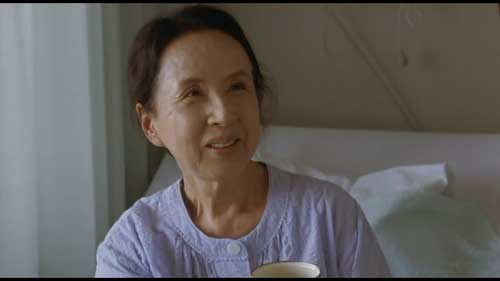

我覺得，在這部片中，導演很擅長用不明說的細節刻劃方式，來闡釋她想要述說的主題，或提出矛盾與問題使觀眾思考。

例如在醫生這個行業，好像現實的印象已經都集中在高穩定收入和追求利益的焦點上了，影片一開始醫師失蹤時刑警的對話無意中透漏了這一點，那位有醫生女兒慈祥的母親(不好意思，我忘了名字)三個女兒回來時，兩個女兒有點嫉妒譏刺的對話裡也反映了這一點(收入比我們多了兩個位數…聽說還包養一個男生阿…等等)。

一天晚上，相馬在真誠仰慕伊野治醫師的一番話語中，透露著他對只注重醫院經營收益的父親強烈不滿，這恰恰也反映了，現代人對醫生冷冰冰自私追求利益的質疑、醫者本身在仁心救人與追求收入的矛盾。

在這偏遠的小鄉村，導演以警察的詰問調查、醫生與村民的互動、還有相馬在旁實習中心崇拜的話語，見證了這充滿溫情信賴的醫病關係是如此的可貴。然而，到後來直到所有人發現伊野治是一位冒牌醫師後，這樣的醫病關係格外的諷刺。

在看這部片時，我還有一個想法，就是每個人心裡真正的想法，其實跟他互動的人不一定完全認知到，作為觀眾的我們有時也很難猜透解讀。

在氣胸病人的那一天晚上，護士在成功救治病人以後回到廚房時雙腿一癱蹲下來大口喘著氣，在她瞪大的雙眼裡究竟在想著什麼?是單純巨大的壓力解除了嗎?還是開始對醫生產生質疑了呢? 相馬熱情地說出以後要像伊野治醫生樣成為地方的鄉村醫生時，他有好好地聽伊野治說話了嗎?伊野治又是在怎麼樣矛盾的心情和壓力下，看著眼前這個有可以有醫師執照充滿希望的真正醫師充滿對自己崇敬的樣子說出「我不是醫師」?

伊野治與罹癌母親和他女兒的互動也很微妙，母親含辛茹苦的帶大三個女兒，卻以不敢為女兒添麻煩的心情苦苦忍耐自己的病痛，直到伊野治醫生的出現，她才放心交給他診治，而且臉上綻放了許久未見的燦爛笑容。是多年來的悶著的心情解脫了嗎? 還是為多了除了女兒外可以依靠的人感到特別溫暖?

伊野治醫師為她做了胃病理切片，得知是第五類確定癌症時，陽光照進陰暗的診療室和他凝重的臉相輝映時，他心裡又是怎麼想的? 在告知她女兒與對母親的承諾中掙扎? 為自己實際上沒有能力還來這邊充英雄感到後悔? 還是下定決心真的無論如何都要治好這位特別投緣的母親?

片中翻閱胃癌相關書籍、與藥商合作假造母親病例、苦口婆心要她女兒相信她母親沒有問題，究竟又是出於怎麼樣的想法呢? 至於最後說出真相，選擇丟下白袍一走了之，我猜可能是在與女兒的對話中，感覺到子女對父母深深虧欠的真情而有所共鳴，又意識到現在不說女兒恐怕就沒有機會見到她母親，才會做出這個決定吧? 只是在這邊伊野治曾說過我是個不孝子，與後來逃亡時深夜在一個電話亭裡，打給爸爸說出對不起是我偷了你的筆的情節相對照時，讓人不禁想猜他究竟有怎麼樣的過去?有曾經想當醫師濟世救人的夢想卻考不上嗎? 想像爸爸一樣成為偉大的醫師卻沒辦法做到的虧欠感嗎? 來到這個村子假冒醫師，被村民簇擁的自信，是否在另一個程度上彌補了他過去的遺憾?

我覺得，這枝上面有刻醫院院長姓名縮寫的筆，代表著是一種身分地位與責任的象徵，伊野治披上白袍用了這支筆，代表著他想成為真正的醫師一般有能力救治村子裡的人，在片末哭著對父親對不起，則是他難過得自認為他已不能再負起這樣的責任，能負起讓病人信賴治好病人的責任。較有明顯結語的，恐怕是在旁調查的警察，還有最後趕到的女兒。警察一語道破，是村民和周圍的人的期待，使他從假醫師變成了真醫師，卻沒有人願意聽他說。女兒說，她不會對伊野治提出告訴，反而她認為要被訴的是她自己，也許她認為，做女兒的竟不如一個冒牌醫師讓母親信賴，是自己的不孝吧? 導演的手法其實真的很細膩，留下了許多不明說的片段讓觀眾細細思考，我還覺得，一開始，一個瘋瘋癲癲的村民披著白袍的情景，是不是也象徵著什麼?是比喻伊野治在這邊假冒充英雄，真的是瘋狂無可救藥的行為嗎? 還是有什麼隱喻?

警察在片末，我強烈還疑他們其實是明知已經找到他可以逮捕了，卻有默契的看著他上了火車放了他。
