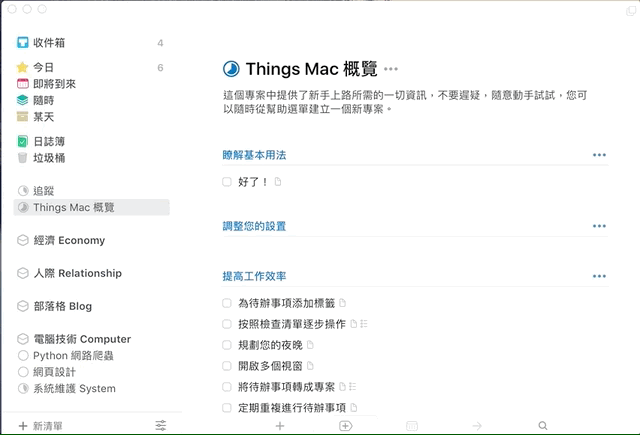
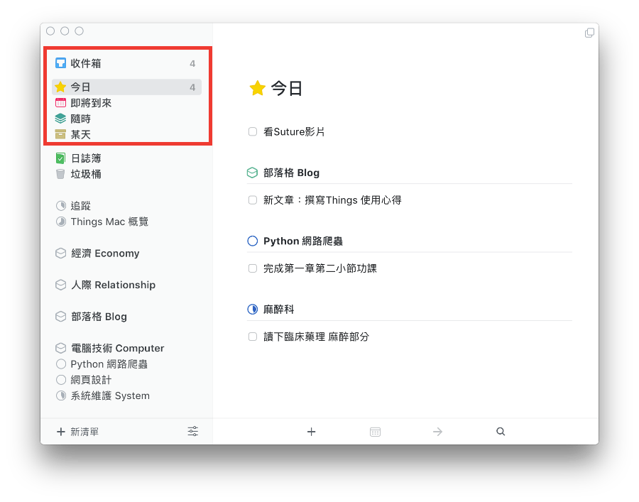
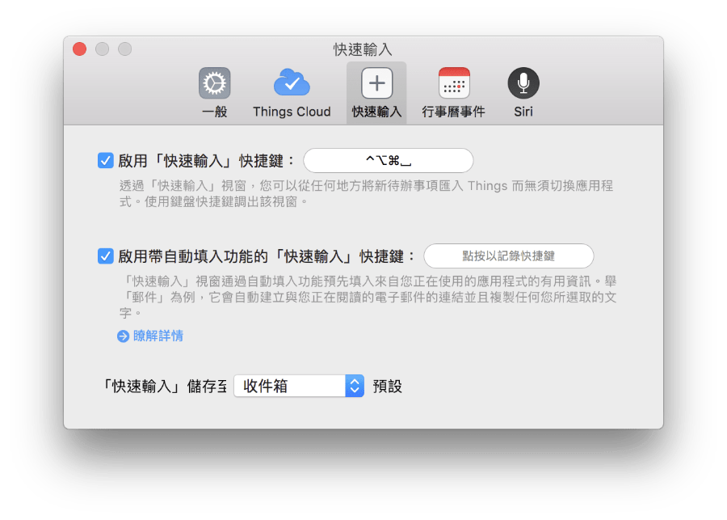
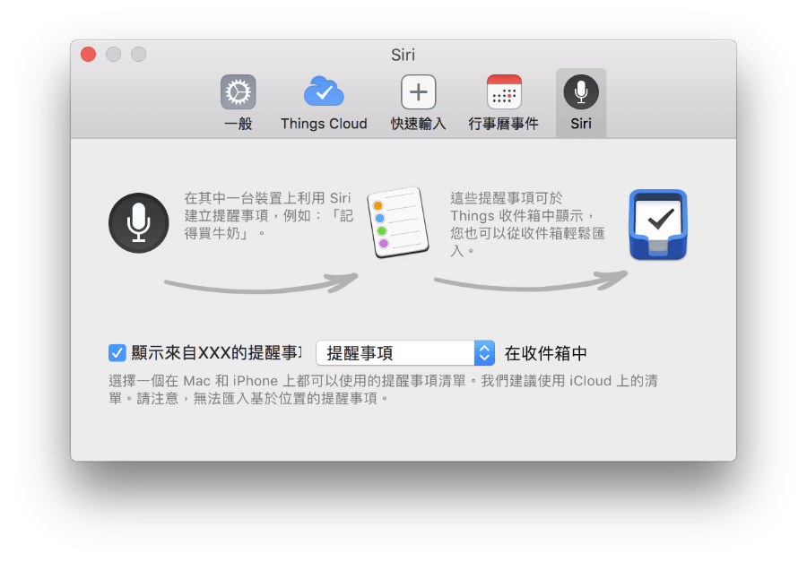

Things 開發團隊在經過多年後，終於更新了Mac OS X上的Things App, 帶來了優雅簡潔的操作體驗。就算不懂GTD概念的人，也可以輕鬆上手，讓自己的生活更加積極有目標！

## 對Things 3 的第一印象: 乾淨、典雅、簡潔

最近流行「顏值」這個詞，毫無疑問，第一眼看到Things 3 的介面時，素雅的淺灰底以及簡單的側邊欄兩欄設計深得我心。官方直接將說明製作成待辦事項清單，想探索學習時直接點選閱讀即可。

筆者對效率工具的要求主要有幾個方面：條理分明的閱讀、完整的快捷鍵支援、簡潔流暢的操作流程，最好可以再加上擴展外接支援一類的使其可以和其他工具合作併用。在閱讀方面，Things 3 運用簡單的動畫以及顏色分層特效，營造了舒服的操作體驗。

[Mac App Store連結，同時有iPhone以及iPad 版，分開收費](https://itunes.apple.com/tw/app/things-3/id904280696?l=zh&mt=12)

## 概念探索：專注在「今日」的規劃哲學

用過像OS X內建的提醒事項、Wunderlist奇妙清單，Things 3 的「今日」、「即將到來」、「隨時」、「某天」等預設的時間分類相較之下是最不一樣的特點。希望使用者能夠專注在當下並不延宕，Things 大為簡化了待辦事項放入「今日」的流程，包括：

1. 新增或是點選任何已經存在的待辦事項時，⌘ + T （Today）or ⌘ + E (Evening, 今晚)，可以直接放入「今日」時間分類
2. 所有在前一天未完成的事項，會繼續留在後一天的「今日」時間分類
3. 已經排程好的待辦事項，在排程日期已至也會自動歸入「今日」分類檢視

Things 3 的作者團隊提到，他們希望的流程為，使用者可以在早晨起床泡一杯咖啡準備今日的工作，或者在下班之際，直接在「今日」時間檢視整理待辦事項清單。

而即將到來、隨時、某天的排列順序，則反映了事情的緊急程度以及急迫性，當使用者在歸類待辦事項時便自然排序了重要性先後。

## 快速鍵支援

前面提到，筆者希望在使用效率類工具時，希望有完整的鍵盤快速鍵支援，Things 3 在管理待辦事項的流程中，許多細節動作都有快捷鍵，的確可以增加操作速度。

### 1. 隨時隨地進行搜尋、快速切換

在Things 3 的任何一個畫面，隨便輸入任何東西就會開始搜尋了。搜尋目標包含區域、主題、專案、待辦事項的標題以及內容。因為包含標題，所以也可以用來快速切換想要瀏覽的分類。另外，⌘ + 1, 2, 3, 4, ... 可以依序切換左側邊欄由上至下排列的「收件匣」、「今日」、「即將到來」、「隨時」、「某天」等

### 2. 新增待辦事項 > 後處理

⌘ + N 以及其他配合的修飾鍵新增主題、專案等其他分層，是許多程式共用的邏輯，並不特異所以也不多加贅述，這邊想描述的是新增待辦事項以後，如何繼續流暢進行後處理。

在新增待辦事項的畫面輸入標題後，Tab 可以切到備註以輸入詳細內容，⌘ + T 可以直接將其放到「今日」，或者其他對應時間分類的快速鍵。⌘ + S (Schedule) 可以直接安排更詳細的時間並設定提醒時間（會自動在所有同步的裝置包含iOS裝置跳出通知）。⌘ + Shift + M 可以將其移動到不同的清單。

### 3. 隨時叫出新增視窗，無論有沒有在Things 3 內

只要設定好快速鍵，無論你在瀏覽網頁或是收發電子郵件，不用切換到Things 3 視窗就可以快速輸入。安裝Helper以後，甚至可以直接選取文字後快速新增，這樣就不用手動輸入落落長的內容。

> [官方快速鍵說明：https://support.culturedcode.com/customer/en/portal/articles/2785159](https://support.culturedcode.com/customer/en/portal/articles/2785159)

## 分層的概念：區域、專案、主題、待辦事項、檢查事項

> 這部分程式的中文翻譯不一致，請注意

標題所列依序為Things 3 的分層架構。區域可以簡單區分私人、經濟、工作領域。比如說像筆者就區分為個人健康、家庭、學習、醫院工作等。專案為偏向一項大目標擬訂計畫的組合，這是基於將抽象目標分解為詳細步驟以具體化行動較有效率的概念。

在Things 3 裡，專案標題的圖示會以完成百分比的圓餅圖表示，每完成一個專案下的待辦事項，代表專案離完成又進了一步。專案內可以用不同的主題簡單區分。而每個待辦事項底下又可以拆解成無數個檢查事項。

當然，生活雜事不一定都要硬要歸到宏大的專案清單裡，可以簡單的在收件匣或是任一區域內直接新增，相當自由。

另外，Things 3 在後續的更新裡新增了重複性待辦事項，可以自行設定重複週期。

## 整合

### 匯入

為了方便其他待辦事項App的使用者轉移到Things 3, 開發者團隊也有提供一些匯入方式，像筆者原先是Wunderlist 的愛用者，就很欣喜的發現Things 3 可以匯入，不用手動重新輸入。

### Siri 呼叫！

蘋果內建的Siri 語音輸入如果有默契的話，平常可以直接語音輸入待辦事項很快，可惜預設是使用蘋果裝置內建的「提醒事項」App, 不過Things 3 技巧性的轉彎，要求對於「提醒事項」的存取權，他會自動掃描並直接匯入。於是在Mac OS X 或iOS 裝置上Siri 輸入待辦事項後，就會自動收集到Things 3 內。

### 其他App 的整合

由於Things 是相當好用的待辦事項軟體，其他App或許也會設計快捷方式以收集到Thing 內。像Airmail 會自動偵測郵件內容的時間並套顏色標註，使用者點選以後便可以一鍵在Things 3 建立該時間點的待辦事項並複製郵件內文到事項備註。

## 短板

Things 3 儘管強大，也有一些不足的地方。筆者認為，跟Wunderlist 比起來，Things 3 明顯缺乏團隊共享的機制，不像Wunderlist 可以加入協作團隊到清單內並指派任務。中文翻譯也有一點瑕疵，另外，筆者也希望，Things 3 可以新增夜間模式，提供使用者將白底換成黑底布景的選擇。
