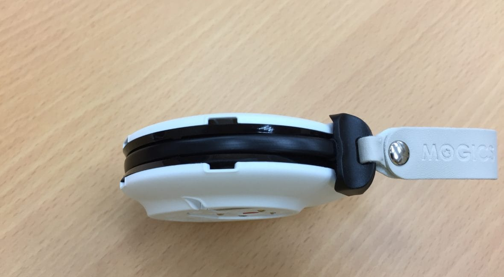
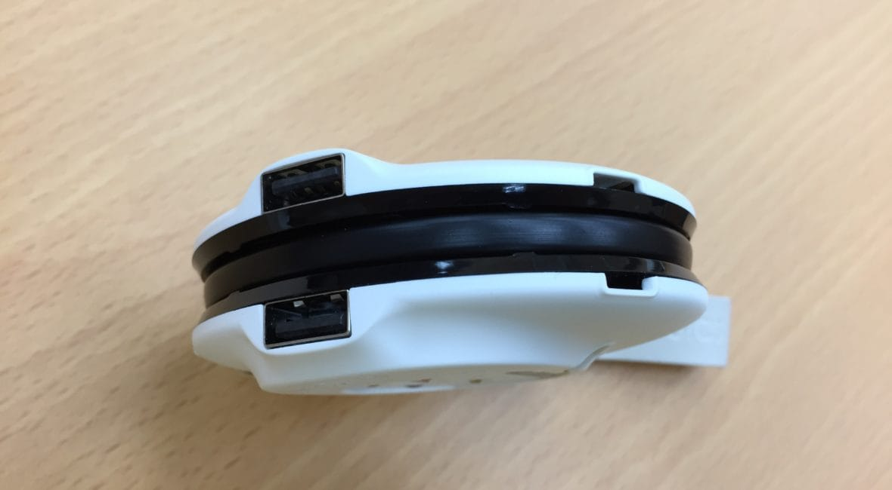
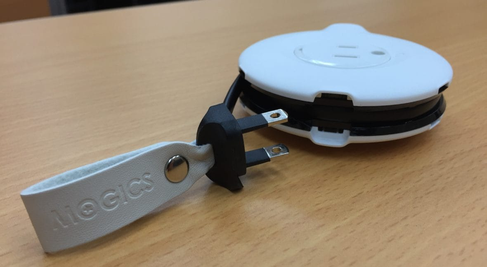
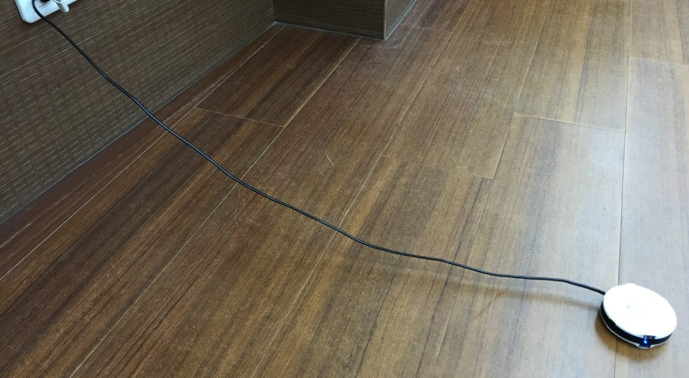
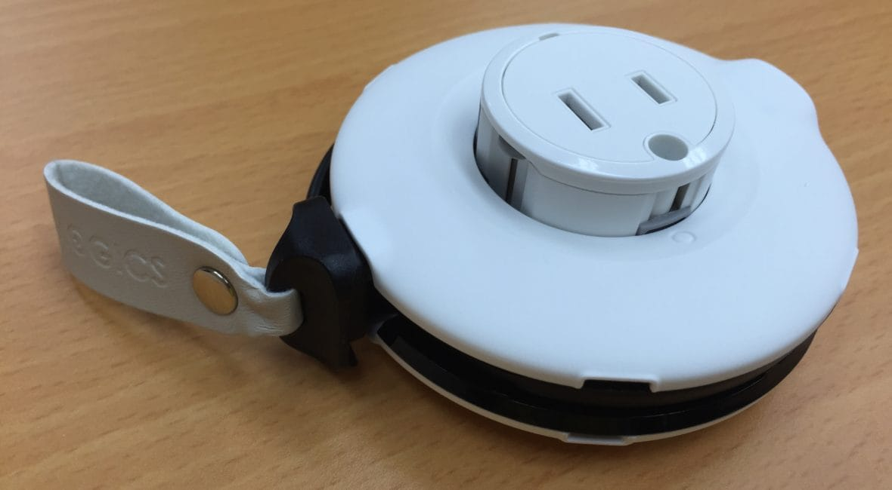
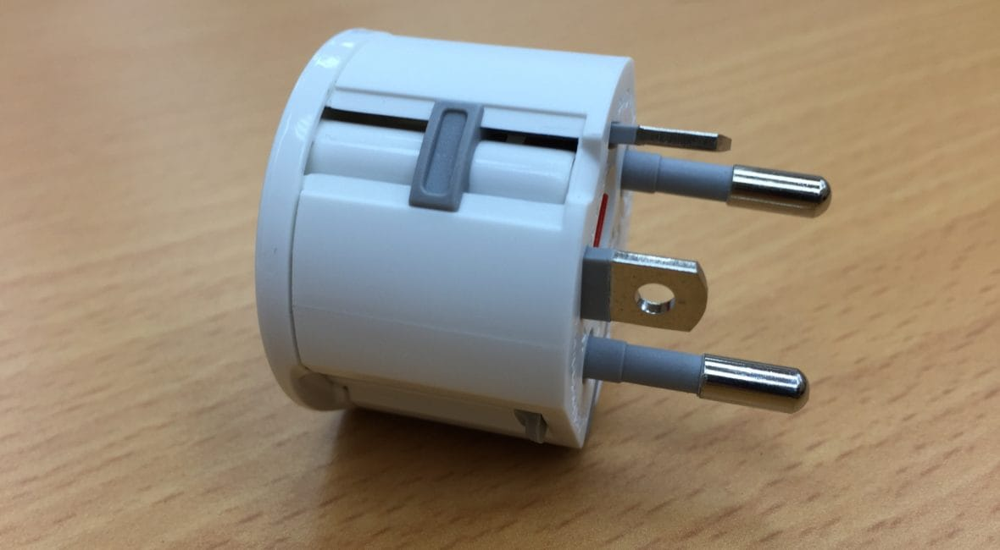

不知道大家有沒有聽過國外的Kickstarter 募資平台？，在台灣，我有時會瀏覽相類似的平台，flyiingV，看看有沒有讓我眼睛一亮的idea企劃。而在今年初，這個Power Donut 的產品企劃吸引了我的目光，於是我便參與募資，而於今年六月，我收到了順利出貨的成品，以下是開箱文。

# 產品外觀

Power Donut的定位是一個「旅行便攜用的延長線」，可是看完照片，猜猜看，延長線上的插座在哪裡呢？第一眼可能會覺得是俯瞰視角中間那個明顯的插座孔，這樣想就錯囉！（哈哈剛拿到我也被騙）

仔細看側面，有沒有發現側邊有兩個USB 孔，轉一圈發現每隔一小段就會有插孔，沒錯！這個延長線跟一般傳統的長條型延長線不一樣，插孔是做在圓周邊的！

# 使用情況

要使用時，只要將插在側邊收納孔內的插頭拉起來，就可以完全展開了。

插滿東西完全不是問題！

問題來了，那Donut中間的插孔是什麼？

原來是旅行用國際規格插孔轉接頭，還設計成可以嵌進Donut中間孔洞

# 設計理念與優點

這個產品最讓我驚艷的特點有：

* 將傳統長條型延長線插孔並列分佈改設至圓周，在最節省空間的情況下最大化插孔間隙
* 得利於Donut 圓形設計，延長線可以捲繞收納，增添便利性
* 另外設計選配旅行轉接頭，完美收納至Donut 中間空間

我甫一拿到，便拿給親友看，都獲得不錯的評價。由於產品剛從募資狀態下發表，產品訂價仍稍嫌貴，但是降價到約五六百塊喔，因其實用方便的設計，我看好他後續的市場販售。

[FlyingV 計畫連結](https://www.flyingv.cc/projects/10948)
