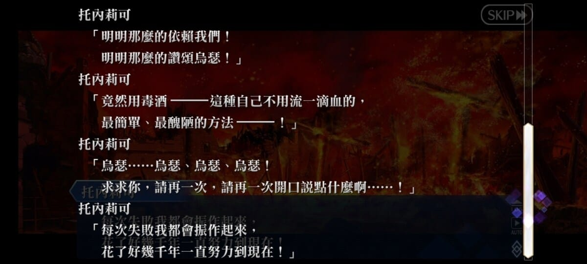
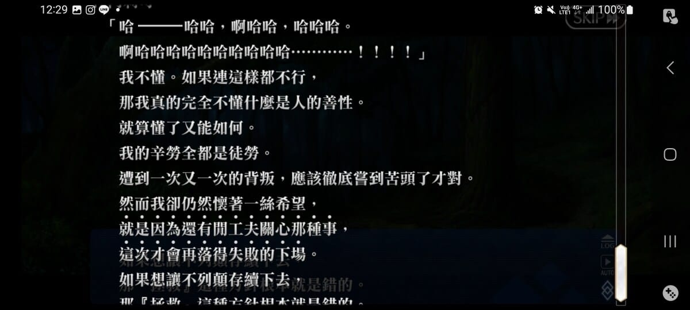

台版 Fate Grand Order 是從大學以來，唯一一個一直有在玩的手機遊戲，雖然中間曾經有怠惰期，最嚴重連續幾個禮拜沒有登入，或者連續跳過兩三個活動沒有打，但放在手機桌面，心情回復後還是多少會登入點一下。

## 前情提要

* *以下文章開始有雷*
* Fate Grand Order 的世界觀延續 Fate Stay Night 遊戲、動畫相關創作的設定：
  + 在此世界觀中，「御主」可以行使召喚契約召喚英靈為之戰鬥
  + 英靈來源存在於「英靈座」，有可能是古代戰功彪炳的戰士、大殺四方的帝王，或者存在於神話傳說的神明、魔術師等等，後來延伸到近代知名的創作家、影響歷史深遠的科學家也有可能。
  + 英靈的不同面向、不同能力特化、或者不同的故事軼聞，都有可能化作英靈座上記載的不同形象，可以化作不同職階被召喚。甚至被背叛、黑暗、被仇怨纏身的一面，也有可能被特殊召喚成反英靈。
  + 原先 Fate Stay Night 僅設定為在遠東日本一都市地區的召喚系統，目的為透過七騎英靈的相互爭鬥完成魔法儀式，完成後御主則可以透過戰敗英靈魔力灌注的聖杯，許下「萬能願望」
  + Fate Grand Order 則將此召喚系統進一步延伸，玩家扮演召喚英靈拯救世界危機的御主，然後穿梭在不同世界遇見不同的英靈角色。

## 妖精圓桌領域

### 故事背景簡要

* 妖精圓桌領域，是台版 Fate Grand Order 新開幕的一個假想世界
* 該假想世界可視為與現行世界不同的時間線分支
* 在這世界觀裡，引用了英國不列顛的知名亞瑟王傳說的設定，然後加上了劇情創作者自己的闡述：
* 原始神話亞瑟王傳說裡的摩根，有三重性質：
  + 早期樂心助人與人為善的湖中精靈
  + 基督教轉化後亞瑟王內傳說的魔女，有各種惡毒的描寫描繪
  + 但有時又有守護亞瑟王的性質，帶領亞瑟王道傳說中的理想鄉阿瓦隆
* 故事裡的摩根，作者設定的背景為，被傳說中理想鄉樂園阿瓦隆派來星球外側，不列顛島嶼上，要拯救不列顛。
* 在導致時間線分支的重大事件後，不列顛陸地消失，而六名妖精之祖犯下弒神的罪行以創造他們生存的空間，遭到了詛咒。
* 除了原先的詛咒外，**妖精的本性是全憑一時衝動、喜好厭惡行事**，幾乎沒有現代人類的道德倫理。
* 有罪的妖精持續繁衍，然而詛咒的災厄、妖精的爭鬥本性、導致延續了千年的不列顛大地最終毀滅淪為一片荒蕪。此為摩根第一次失敗。
* 故事中英靈召喚系統的介入，導致正史中的摩根意外介入，將情報傳給過去失敗的摩根，讓此分支假想世界的摩根有機會在千年前拯救不列顛。

### 救世主時期

* 在此分支世界，曾作為救世主，拯救了不列顛不知道多少次，化解了不知道多少個災厄
* 但樂園阿瓦隆來的妖精，被不列顛的本土妖精本能地厭惡，因為其存在提醒他們贖罪懺悔的義務
* 每一次盡心盡力地拯救不列顛與妖精，化解災厄。**但幽禁、水牢、火刑、流言、驅逐、背叛、暗殺樣樣皆來，沒有絲毫感謝、沒有絲毫贖罪懺悔之心**，就這樣持續了將近千年
* 在忠實扮演其角色的最後一次，與夥伴調解了戰爭，建立了人類、妖精氏族間理想的政治體制，與戀人人類騎士烏瑟打算走入婚姻聖堂加冕為后，千年期待許久治世的到來，看似一切的努力終將走到幸福完滿的結果
* 卻在加冕式的當天，親眼看到烏瑟被毒殺，妖精叛亂再起，救世主被冠上莫須有之罪，一切再度化為烏有

> 我不會再拯救任何妖精，這不列顛的妖精，每一個都不值得拯救

### 冬之女王摩根

* 不再相信任何人，千絲萬縷的理想化為冷酷
* 拯救不列顛的夢想，轉化成建立、維持美好的不列顛大地的執念 (裁職 Ruler -> 狂職 Berserker)
* 摩根直接君臨天下，任由災厄滅絕妖精之後，因為王國的延續仍然需要妖精臣民的存在，直接用大召喚術等級的魔術，強行以類似聖杯英靈召喚契約的儀式，召喚了所有妖精
* 實施高壓統治，卻意外有效的維持了美麗的不列顛王國兩千多年
* 雖然身為假想世界女王，與玩家扮演的角色一行人立場為敵，在決戰時以強大的魔術實力輕鬆碾壓玩家
* 卻仍死在**妖精的惡意**之下，趁摩根分神時，*以最疼愛的乾女兒要挾，煽動原本最忠心的部下背刺，最終死得面目全非*
* 女王的回顧，有一格靜畫提到，摩根如此熱愛不列顛的大地，如果有一天外面世界有訪客來到，他真心希望，能夠衷心讚嘆他維持王國的美麗光華，那摩根就會非常開心。
* ~~遊戲劇情創作者蘑菇真的沒有人心~~

> 我的國家如何？
> 是個美麗的國度嗎？是個如夢似幻的國度嗎？
> 如果你這樣認為，我將感到無上的喜悅。
> 歡迎來到妖精國不列顛，客人
> 但願這片景色，
> 可以永遠留存在您的記憶中

## 共鳴

* 在遊玩到此故事時，剛好處在一個有點極端的心境
* 為了曾經熱愛的理想、親人奮鬥了許久，卻發現許多隨口說出的話，只不過是當下一時的喜好厭惡。
* 無法改變的事情有太多，尤其是最難改變的是人心、習以為常的行為模式。溝通模式千轉百折，努力了許久，卻從來沒有一絲奏效。
* 我看到摩根那千年的疲憊、最後的崩潰、以及對應冷酷的反轉，彷彿映照了自己的心境。**不想再理會，也不想再花心思拯救，就是因為有這閑心思想拯救，才會一次又一次又淪落**
* 渴望擁有最終成為冬之女王摩根那般宰制、統御的力量
* 以上心緒的映照，讓摩根這個遊戲的角色，成為 Fate Go 有史以來共鳴最深的角色。先前抽角色可能只是因為立繪漂亮或者強度，這次下定決心要抽好抽滿。~~當然也有可能是因為高冷御姐形象剛好是我的菜~~
