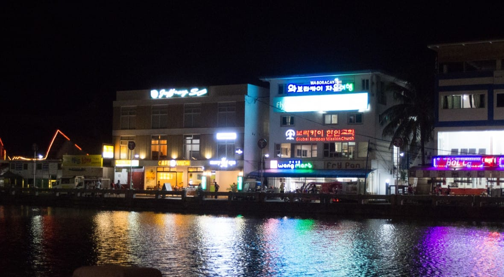
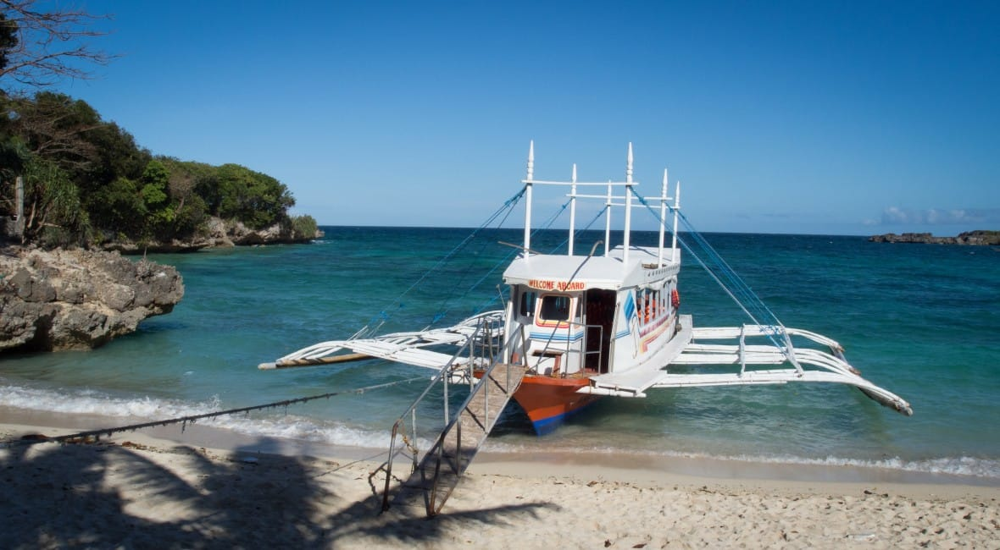

不知不覺，醫學系也念了五年了。不復當年的青澀，責任悄然地披掛上身，隨口而出的醫學典故玩笑也變成朋友打鬧的日常，一絲絲的不甘，點點滴滴的不捨，於是我們選擇這個五年級的寒假，一起出遊。

對我來說，這是人生中第一次踏上台灣以外的土地，出入海關，檢疫安檢，都是嶄新的體驗。幸虧台灣以及菲律賓卡利波機場的海關對愣頭愣腦的觀光客十分友善，沒有多加為難。

如果真的要問我，在台灣旅行跟出國觀光的不同是什麼？我會說，是以一個過客、外來者的角度，觀察、互動，任由新鮮的體驗洗刷著陳舊、鏽跡斑斑的靈魂。

長灘島，被導遊形容為「菲律賓離島中的離島」，

長灘島是完全以觀光發展為導向規劃的區域，舉導遊所說，許多物資包括海鮮、水果，都是從菲律賓本島運過來的。在嚴謹的環境保護政策下，長灘島可貴地吞吐每日可觀的遊客流量，卻又能夠保留乾淨的海岸。沒有如台灣都市嚴重的空污，海天一線如詩如畫的風景，是我初來此地時最感欣喜的地方。

觀光客聚集的最主要地點，是以一片沙粒細細密密有如麵粉的沙灘，再向內擴展為熱鬧商圈的區域。近年來，由於華人文化圈旅遊風氣的興起，商圈內也出現了不少東亞導向的餐廳、飯店，甚至店名招牌會穿插幾句簡體字，沿路叫賣的攤販偶爾出差幾句中文。擁擠人群中亞洲東方面孔的超高比例、以中文吆喝海岸邊乞討金錢的小孩，都一再的反映長灘島中國、台灣、韓國、日本遊客數量的可怕。

我曾經在旅途中，問過好友：「如果你是台灣某塊區域的觀光局長，擁有和長灘島一樣的裡環境條件，你會希望將其經營成像長灘島這個樣子嗎？」

為什麼我會想問這個問題呢？是因為在長灘島，我看見商業資本導向下觀光高度發展必有的犧牲，遊客前來入境隨俗，但整塊區域卻也開始迎合了觀光客。雖保有原始的海岸風情，但在當地居民皆以觀光產業討生活的情況下，菲律賓當地的文化往往被喧賓奪主，參雜了太多外來的東西。在長灘島，可以看到混合當地食材的高級吃到飽Buffet，號稱印度傳統醫學的SPA按摩，還有漂亮的西式點心店。

不過我想這也是人類社會高度互動的必然結果，倒也不用特別喟嘆可惜。該讚揚的是，儘管容納了高流量的遊客，長灘島的沙灘仍舊如此乾淨。不想理會背後喧囂的街道時，盡可以悠悠哉哉地躺在麵粉細沙的海灘上，欣賞乘載著無數笑語的藍色風帆飄揚，沐浴在落日餘暉及海風吹拂。水上活動也很精彩，想要享受乘風破浪的刺激，高空俯瞰的樂趣，或是浮潛深潛，這些也都可以滿足你。

對於這次旅行，我很高興可以跟平常一起努力鑽研醫學、在醫院辛苦工作的同學一起放輕鬆的出遊。忘掉自己生命中必須承擔的痛苦與疲憊，盡情的嘴炮和閒扯淡，還有偶爾偷拍幾張美景和照片鍛鍊自己的攝影技巧。

長灘島的沙灘，謝謝你的愜意舒適，我們再會了。
